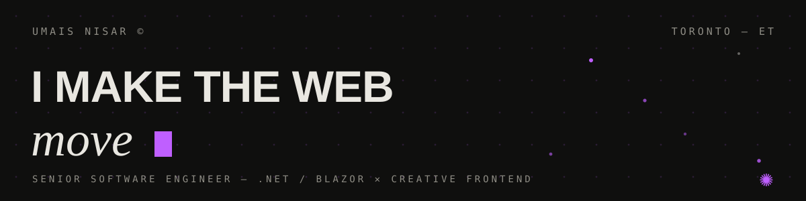

<a href="https://myportfolio-coral-nu-32.vercel.app">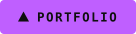</a>&nbsp;<a href="https://www.linkedin.com/in/umais-nisar-18ab70220/">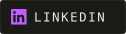</a>&nbsp;<a href="https://www.instagram.com/umais.nisar/">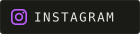</a>&nbsp;<a href="mailto:umais.nisar01@gmail.com">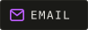</a>

## ✺ About

Senior Software Engineer at **VCA Software** in Toronto. I ship .NET/Blazor products by day and build animation-driven web experiences after hours — I think the browser is a medium, not a document viewer.

- 🎓 M.Sc. Computational Sciences — Laurentian University · B.Sc. Computer Science — FAST-NUCES
- 📜 Microsoft AZ-900 certified
- 🌐 The best introduction is the portfolio itself: **[myportfolio-coral-nu-32.vercel.app](https://myportfolio-coral-nu-32.vercel.app)** — custom cursor, physics dot-field, scroll choreography, a lights-on mode and one hidden mini-game

## ✺ Stack

**Day job**

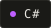 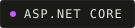 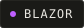 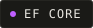 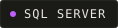 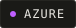

**After hours**

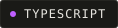 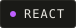 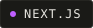 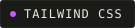 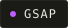 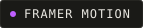

## ✺ Selected Work

| Project | What it is |
| --- | --- |
| **[MyPortfolio](https://github.com/UmaisNisar/MyPortfolio)** | This portfolio — cinematic, animation-heavy, 100% static frontend · [live ↗](https://myportfolio-coral-nu-32.vercel.app) |
| **[InvestAdvisor](https://github.com/UmaisNisar/InvestAdvisor)** | Personal AI investment advisor — LLM analysis over a factor-model screener, multi-currency, free-tier data only |
| **[TandooriTasteWebsite](https://github.com/UmaisNisar/TandooriTasteWebsite)** | Restaurant site + full self-serve CMS (Next.js 14, Prisma, NextAuth) · [live ↗](https://tandoori-taste-website.vercel.app) |
| **[the-hidden-gem](https://github.com/UmaisNisar/the-hidden-gem)** | Portfolio & booking site for a sports photography studio |

 

*the web should* ***move*** *✺*

